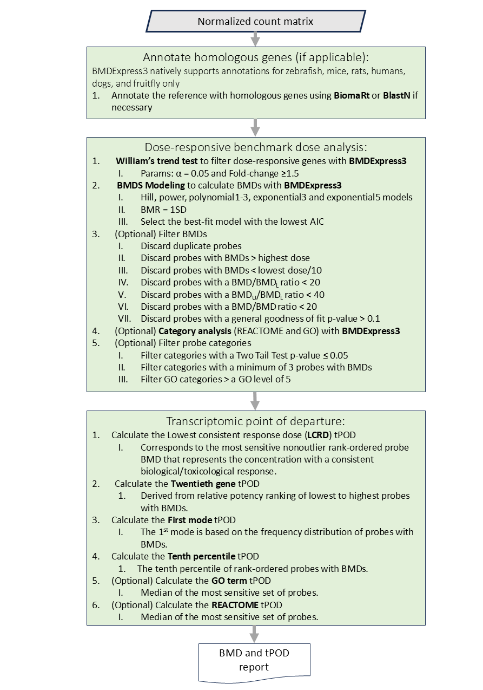

# Ecological 'Omics Data Analysis Pipeline (Eco-ODAP) for Regulatory purposes using High-Perfomance-Compute

## Overview
This pipeline aims to process and analyze RNA-seq data from toxicogenomics experiments using the [Main Regulatory 'Omics Data Analysis Framework](https://github.com/R-ODAF/Main), as well as [BMDExpress3](https://github.com/auerbachs/BMDExpress-3) to derive transcriptomic points of departure (tPODs), specifically for but not limited to ecological fish species. The pipeline is compatible with high-performance cloud computing (HPC) platforms that utilize [SLURM workload management](https://slurm.schedmd.com/documentation.html) such as the [Digital Research Alliance of Canada (DRAC)](https://alliancecan.ca/en).
The pipeline was originally designed to reanalyze all the publicly available transcriptomic (RNA-Seq) datasets that used a dose-response design and ecological fish species.

A key issue that this pipeline aims to overcome is, there is uncertainty in toxicogenomics regarding the most appropriate statistical and programatic approaches to processing RNA-seq data and calculate tPODs. This pipeline contains state-of-the-art tools, methods, packages, and statistical approaches to derive tPODs from demultiplexed raw RNA-seq files. It provides sample and gene-level quality control, outlier removal, batch-effect correction, minimum thresholds, and filtering statistics recommended by the [R-ODAF](https://doi.org/10.1016/j.yrtph.2022.105143), and the guidelines of the [U.S. Environmental Protection Agency National Toxicology Program Approach to Genomic Dose-Response Modeling](https://ntp.niehs.nih.gov/publications/reports/rr/rr05). This pipeline aims to enhance the reproducibility of reliability of transcriptomics data analysis for regulatory or research applications and act as a baseline to build upon and deploy on high-performance cloud computing platforms, specifcally DRAC or other platforms utilizing SLURM. However, no guarantees can be made about the quality of your data analysis if you choose to use this pipeline. Other bioinformatic tools (e.g., [Nextflow RNA-seq](https://nf-co.re/rnaseq/3.16.0)) likely better suit you if you are not planning on analyzing RNA-seq data for toxicogenomics regulatory or research applications.

I highly recommend you also visit our colleagues' [Health-Canada version](https://github.com/R-ODAF/R-ODAF_Health_Canada) of the R-ODAF which has similar aims. The main differences being that the Health-Canada version is more advanced and tested, compatible with both RNA-seq and TempO-Seq, developed with mammalian species in mind, and with the intention of being executed on a dedicated local server rather than a high-performance cloud computing platform like DRAC.

These instructions will help you get this repository running in an HPC environment that uses SLURM such as DRAC.

## Workflow
Much of the workflow from this pipeline is the similar to the Main version of the R-ODAF.

Different steps of the pipeline are intended to be submitted as jobs.
In order to execute multiple steps of the pipeline automatically in succession, submit the first job, then submit the following jobs as dependencies. For example:

```
user01@cluster1$ sbatch job1.sh
11254323
user01@cluster1$ sbatch --dependency=afterok:11254323 job2.sh
```

### Genereal Workflow


### R-ODAF Workflow


### Benchmark Dose and Transcriptomic Point of Departure Workflow



#### WARNING: Limiations of BMDS Modeling in BMDExpress3
BMDExpress3’s BMDS modeling option cannot generate a General Goodness-of-Fit (GGOF) p-value when the experimental design includes only a single replicate per dose, or if only one replicate remains after sample quality control (QC). If any dose group has only one replicate, it is recommended to remove that group before running BMDExpress3.
The GGOF p-value is derived from a likelihood-ratio test that compares the best Akaike Information Criterion (AIC) model with the fully saturated model. This p-value (fitPvalue) assesses whether the best AIC model fits the data significantly worse than the fully saturated model, which perfectly fits the data. However, the GGOF p-value cannot be calculated when there are insufficient replicates to compute a mean and standard deviation (SD) for each dose group. The fully saturated model requires both the mean and SD for each group, making multiple replicates necessary.
Additionally, there are key differences in how BMDExpress3 handles BMDS modeling depending on the number of replicates per dose group. When there are two or fewer replicates, the program counts all parameters in the model, altering the degrees of freedom calculation compared to designs with three or more replicates.
If you encounter issues with BMDS modeling, consider using the ToxicR model averaging option, which may be better suited for datasets with fewer replicates.

Note: BMDExpress is not a supported module on Digital Research Alliance of Canada (DRAC) servers. You will either need to contact someone and request a module build for a specific version of BMDExpress, or run it locally on a laptop/PC. For this reason I have not included a conda environment for this portion of the pipeline and the program files and dependencies **are not** contained in the apptainer image.

### Running the workflow
The workflow is intended to be executed in order from start to finish.

- Job 1 - Processing the data
- Job 2 - Quality control of the data
- Job 3 - DEG analysis
- Job 4 - BMD and tPOD calculation

However, if after reviewing the output report, you would like to change specific paramaters, individual jobs can be re-run without executing the entire pipeline. E.g., You would like to change the % alignment threshold to 80% in the QC step; change the paramaters, then re-run sample QC, DEG analysis and BMD and tPOD calculation without having to re-process the raw data (which takes the longest to execute).

## Set-up and installation

### Requirements

- Demultiplexed fastq files (compressed or uncompressed)
  - If you need to demultiplex your pooled/multiplexed RNA-seq files, consider using open-source tools like [DePlexer - an ultra-fast, light and versatile C++-based demultiplexing software](https://github.com/rocpengliu/DePlexer) or [Demultiplex - a python-based versatile NGS demultiplexer](https://github.com/jfjlaros/demultiplex)
- Metadata
  - A "Run" column (unique sample name).
  - An "Organism" column.
  - A "Days" column, corresponding to the number of exposure days.
  - A Compound/Chemical column.
  - A Dose/Concentration column.
  - A "DoseUnits" column.
- Basic knowledge of the characteristics of the RNA-seq data. For example:
  - Expected read length
  - Paired or single-end
  - Target sequencing depth (Millions of reads)
- Annotation file (`.gtf file`)
- Reference genome (`.fa` or `.fna` file)
- If wanting to use DRAC, a [DRAC account](https://alliancecan.ca/en/membership/become-member).
  - small amount of experience using the SLURM workload manager - if no experience look at [quick-start guide](https://slurm.schedmd.com/quickstart.html).
- A small amount of experience using command-line/shell.
- Min. 8 threads
- Min. 32GB RAM

### Dependencies

- apptainer
- BMDExpress3
- R
- git

### Cloning the repository
Begin by cloning the repository. The location/machine you clone the repository to should meet the minimum requirements and have the raw data. If using DRAC, clone to scratch directory where you will be executing your work.

### Creating the apptainer image
Because of GitHub's repository size limitation, you will either have to build the apptainer image yourself or download from my Google Drive [link](https://drive.google.com/file/d/1d6QhN1aYcHrZV3WBsWMePOhsnJKHl1hT/view?usp=drive_link).

[//]: # (This folder contains several parts of the apptainer image that need to be combined together. The apptainer image is in parts to get around GitHub's limitations on file size uploads. To build the image from the parts, simply navigate to the `/apptainer_image` folder and execute this command:)

[//]: # (```cat part_* > r-odaf_default.sif``` Once completed, verify that the image was built correctly with all the parts by executing these commands: ```md5sum r-odaf_default.sif sha256sum r-odaf_default.sif```)

[//]: # (The checksums should be: `16aa94fb9cd9a5d890ff699113cb31b8  r-odaf_default.sif` and, `725239ad404aa200d7f293cea67dc179a06f40e20e8213dde4e62ba5f627729e  r-odaf_default.sif`, respectively, if combined properly.) 

Please visit the `README.md` in the `/apptainer_image` folder for more info.

### Installing environments
The apptainer image contains conda which can be used to install environments that are provided in the `/conda_environments` directory. 

Optionally, create a folder to store your conda environments:

```
[user01@cluster1] mkdir ~/conda_envs #Create a readable and writable dir where you can store your envs
```
To enter an interactive apptainer session and install the conda environments on DRAC, run:

```
[user01@cluster1] module load apptainer/1.2.4
[user01@cluster1] apptainer shell --fakeroot --bind ~/scratch/{CLONED_REPO}/:/mnt path/to/stored/r-odaf_default.sif #or ~/scratch/{CLONED_REPO}/apptainer_image/r-odaf_default.sif
```

Load conda, and check if you are missing any environments:

```
Apptainer> source /opt/miniconda3/etc/profile.d/conda.sh
Apptainer> conda env list #Check if any environments are missing
# conda environments:
#
base                     /opt/miniconda3
fastp                    /opt/miniconda3/envs/fastp
multiqc                  /opt/miniconda3/envs/multiqc
r_pkgs                   /opt/miniconda3/envs/r_pkgs
rsem                     /opt/miniconda3/envs/rsem
star                     /opt/miniconda3/envs/star
```

Configure conda to allow flexible channel priority:

```
Apptainer> conda config --set channel_priority flexible #Set the channel priority to flexible to avoid build errors
```

Option 1: Create the conda environments you are missing to conda's default hidden location in your home dir:

```
Apptainer> conda env create --file /mnt/conda_environments/r-odaf_default_DESeq2_report_env_environment.yml
```

Option 2: Or, create the environments in the location you may have created:

```
Apptainer> conda env create --prefix ~/conda_envs/ --file /mnt/conda_environments/r-odaf_default_mymultiqc_environment.yml #Ensure you create your envs in an accessible location.
```

Activate your environments and verify they are installed correctly:

```
Apptainer> conda activate mymultiqc
Apptainer> conda env list #Check that new environment was installed correctly
```

### Configuration and inputs

There are a number of inputs that are necessary to run the pipeline:
- Metadata - **match 'Run' column to filenames of raw files**
- Demultiplexed raw data - **match raw filenames to 'Run' column in metadata**
- Reference genome file
- Reference genome annotation file
- The custom annotations file

And various configurations that need to be adjusted:
- config.yml
- config.qc.yml
- configurations at the beginning of R-ODAF_1_sequencing_DataPreProcess.sh or alternatively in submit_R_ODAF_job_1.sh and submit_R_ODAF_job_1_array.sh if using DRAC or other HPC platform that uses SLURM
- Paramaters in the YAML header of R-ODAF_2_Sample_QC.rmd
- Paramaters in the YAML header of R-ODAF_3_DESeq2_report.rnaseq.Rmd
- Paramaters in the YAML header of BMD_and_tPOD_calculation.Rmd

Please note that the params in the config YAML files should match the params in the headers of the params in the R markdown files.

#### Metadata
A sample of what the metadata can look like is shown in the default `/SraRunTable.csv` metadata file which mimics what metaadata would look like if downloaded from the NCBI GEO database. The essential columns are:
- Run
  - Unique sample names... the name "Run" matches the naming convention used in the metadata file from the [NCBI Run Selector](https://www.ncbi.nlm.nih.gov/Traces/study/?acc=PRJNA515078&o=acc_s%3Aa), where public data (FASTQs) can be downloaded.
- Days
  - The number of days exposed/experiment duration
- Compound
  - Compound or Chemical name
- Dose
  - The dose concentration
- DoseUnits
  - The dose units
- technical_control
  - T/F
- reference_rna
  - T/F
- solvent_control
  - T/F

#### Reference genome files

Reference genome and annotation files can be found on Ensembl's website, or NCBI, depending on the organism. These file smust be present in the `/genome` folder for alignment of the reads. Ensure you download a gene/probe annotation file (GTF) and a corresponding reference sequence file (FASTA). For more information check out the README file for more details.

Environmental fish species:
- [Zebrafish reference](https://useast.ensembl.org/Danio_rerio/Info/Index)
- [Rainbow trout reference](https://useast.ensembl.org/Oncorhynchus_mykiss/Info/Index)
- [Fathead minnow refernce](https://www.ncbi.nlm.nih.gov/datasets/genome/GCF_016745375.1/)
- [Chinese medaka](https://useast.ensembl.org/Oryzias_sinensis/Info/Index)

##### The custom annotation file

The `R-ODAF_3_DESeq2_report.rnaseq.Rmd` script requires additional gene annotations in the form of Entrez IDs and Ensembl IDs. Additionally, the `BMD_and_tPOD_calculation.Rmd` script requires homologous zebrafish gene annotations for environmental fish species since BMDExpress3 does not natively support other fish species. The homologous gene annotations are used only for the category analysis portion of the BMD_and_tPOD_calculation report and not for deriving gene/probe-level tPODs. I recommend you exercise a bit of caution when interpreting the GO Term and REACTOME tPODs for non-supported fish species othat than zebrafish.

Before executing the pipeline, create the custom annotation file using the `/genome/Create_custom_annotations.R` script.
For further instructions, refer to the `/genome/README.md` file.

#### Sample names
The "Run" column in the metadata should match the file names of the raw FASTQ files.

File naming should be as follows:
- Single-end data - `{Run}.fastq.gz`
- Paired-end data - `{Run}{suffix1}.fastq.gz and {Run}{suffix2}.fastq.gz`. 
  - Suffixes can be any typical suffix such as ".R1 and .R2" or "_1 and _2", for example. Suffixes for paired-end data must be defined in the configuration of `submit_R_ODAF_job_1.sh` or `submit_R_ODAF_job_1_array.sh` if submitting jobs through SLURM, or the header of `R-ODAF_1_sequencing_DataPreProcess.sh` if not.

## Outputs

There are several key outputs that are useful to share and review. Key outputs are shown in the workflow images in the previous [Workflow](#workflow) section:

- The MultiQC HTML Report
  - Contains statistics from the fastp, STAR and RSEM tools describing the pre-processed data and the post-processed data
- The Sample QC HTML Report
  - Contains information about what samples pass or fail each R-ODAF filtering statistic, as well as several useful plots such as PCA, heatmaps, dendrograms, bar plots and boxplots that describe the quality of the post-processed data.
- The DEG HTML Report
  - Contains PCA, heatmaps, MA plots, histogram distribution plots, a table of the top significant DEGs, scatter plots, rank-order plots and volcano plots describing DEGs.
- The Normalized count matrix
  - used as input for the BMD and tPOD calculation
- The BMD and tPOD HTML Report
  - Contains information about the specific paramaters used to run BMDExpress3 via command-line, a description of the input data and metadata, statistics describing the number of probes with BMDs filtered by various statistics, a table of tPOD values, gene-level and category-level plots showcasing the six different tPODs, and finally, a summary figure describing the six tPODs.